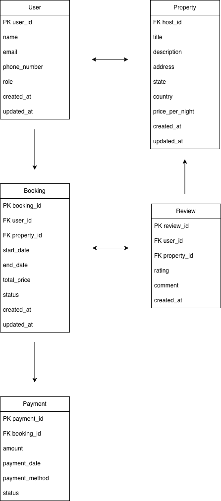

# ER Diagram Requirements

This directory contains the Entity-Relationship Diagram (ERD) for the Airbnb database project.

## Files

- `airbnb_erd.png` — Exported image of the ER diagram

## Description

The ER diagram includes the following entities:

- **User**: user_id (PK), name, email, phone_number, role, created_at, updated_at
- **Property**: property_id (PK), host_id (FK → User), title, description, address, city, state, country, price_per_night, created_at, updated_at
- **Booking**: booking_id (PK), user_id (FK → User), property_id (FK → Property), start_date, end_date, total_price, status, created_at, updated_at
- **Review**: review_id (PK), user_id (FK → User), property_id (FK → Property), rating, comment, created_at
- **Payment (optional)**: payment_id (PK), booking_id (FK → Booking), amount, payment_date, payment_method, status

## Relationships

- User → Booking: One-to-Many
- User → Property: One-to-Many
- Property → Booking: One-to-Many
- User → Review: One-to-Many
- Property → Review: One-to-Many
- Booking → Payment: One-to-One 
